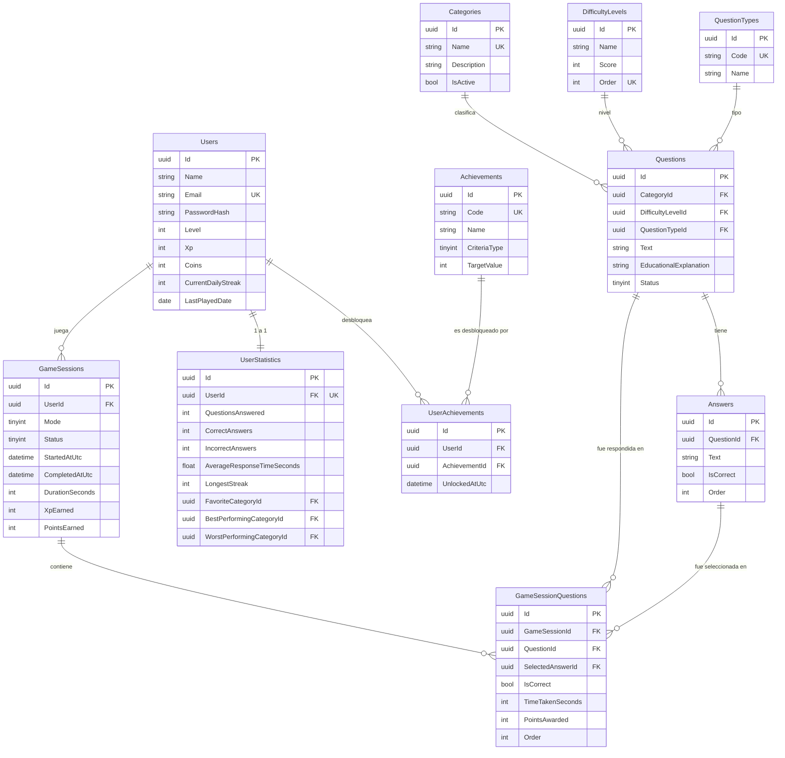

# Modelo Entidad-Relación

Diagrama conceptual del modelo. La fuente de verdad ejecutable es
`backend/prisma/schema.prisma` (PostgreSQL / Neon), donde las tablas usan
snake_case (`categories`, `difficulty_levels`, `question_types`,
`questions`, `answers`, `users`, `user_statistics`, `achievements`,
`user_achievements`, `game_sessions`, `game_session_questions`). Los nombres
en el diagrama son los conceptuales.

Notas de normalización:
- Categorías / Dificultades / Tipos de pregunta están en tablas propias (3FN) — evita cualquier valor repetido/hardcodeado y permite CRUD futuro sin migración de esquema.
- `UserStatistics` es una extensión 1:1 de `Users` (no se fusiona en la misma tabla) para separar el dato "identidad/progresión" del dato "estadística calculada", que se reescribe con más frecuencia.
- `GameSessionQuestions` es la tabla de hechos (fact table) del historial: de aquí se derivan todos los reportes (aciertos por categoría, tiempo promedio, etc.) sin necesidad de duplicar información en `Questions`.
